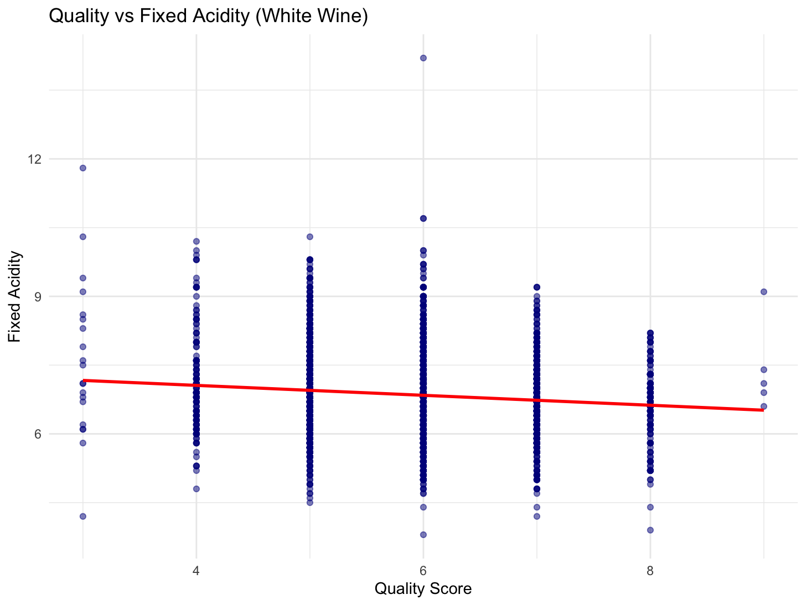
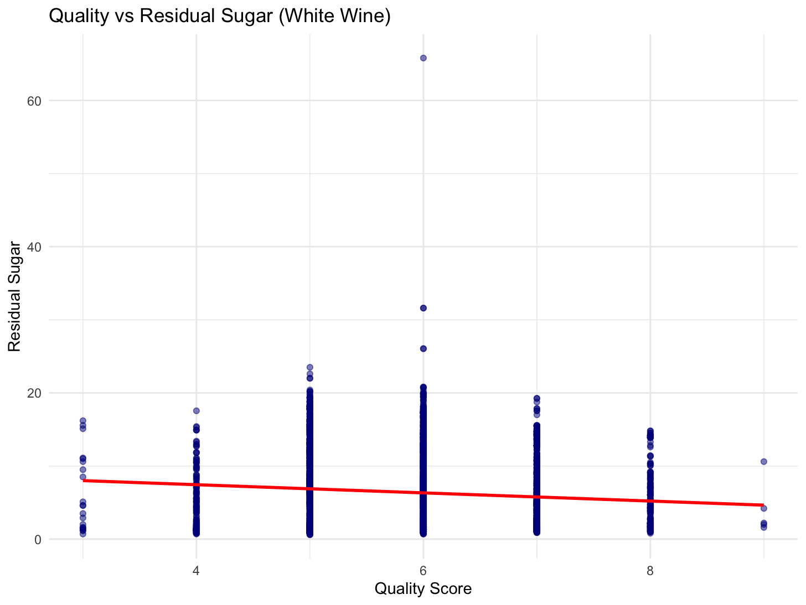
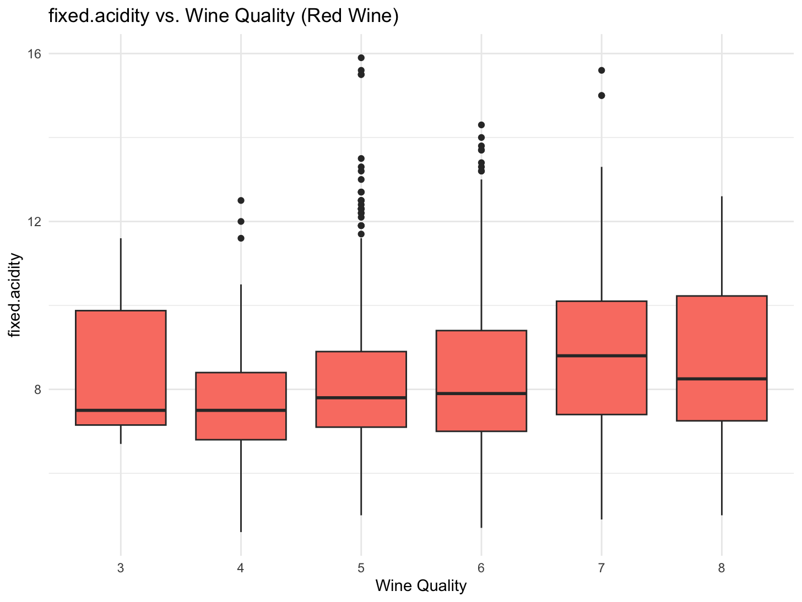
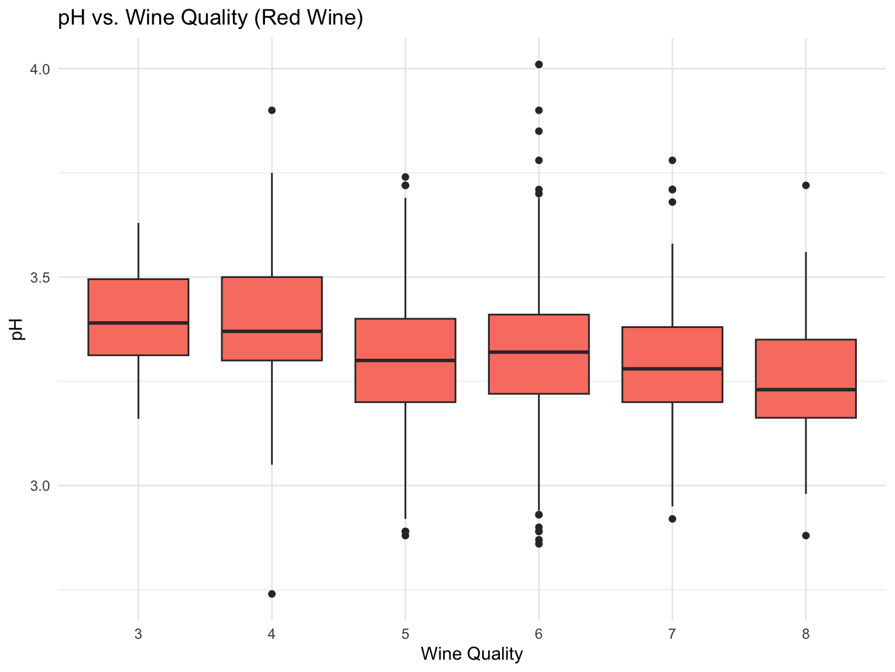
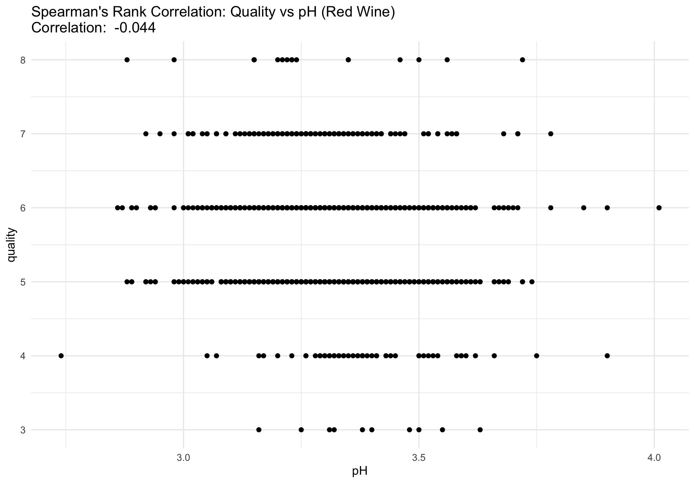

# Exploratory Data Analysis in R

### Author: Harrison Pratt  
### Course: Principles of Data Science  
### Professor: Professor Lopez  
### Date: April 28, 2025  

---

## 1. Business Understanding

When determining if a wine is considered high-quality, there are certain aspects that good wines often have. One of these attributes is having a good fixed acidity. A medium amount of acidity can add freshness and structure but too much or too little can unbalance a wine. Another attribute high-quality wines often have is a good pH level. A pH that is too low or too high can negatively impact the taste of the wine, making it lower-quality. The next important factor is having the right amount of residual sugar. Too much or too little residual sugar can result in imbalanced flavors. Having a balance between these attributes helps create a balanced wine with complexity which are the most important aspects of a good wine.

- **Acidity**: A medium amount of acidity can add freshness and structure to the wine. However, too much or too little acidity can unbalance the wine.
- **pH Level**: A pH level that is too low or too high can negatively impact the wine's taste, leading to a lower-quality wine.
- **Residual Sugar**: The right amount of residual sugar is crucial. Too much or too little can result in an imbalanced flavor profile.

A balance between these attributes helps create a wine with complexity, which is vital for a good wine.

## Sources for Understanding:

- [Perceiving Acidity in Wine - Wine Spectator](https://www.winespectator.com/articles/perceiving-acidity-in-wine)
- [Sugar in Wine - Decanter China](https://www.decanterchina.com/en/news/Decanter%20Features/sugar-in-wine)
- [Sugar Content in Wine Explained - Farang Wine](https://www.farangwine.com/sugar-content-in-wine-explained-which-wines-have-the-most-and-least-sugar)
- [What Makes a Wine Good - Medium](https://medium.com/data-science/what-makes-a-wine-good-ea370601a8e4)

---

## 2. Data Understanding

The dataset consists of wine samples from the North of Portugal, specifically red and white vinho verde wines. The data contains physicochemical tests for each sample. Below is an overview of the dataset:

- **Number of Samples**:
  - White wine: 4,898
  - Red wine: 1,599
  - Total samples: 6,497
- **Features**:
  - 11 continuous features
  - 1 integer feature
  - 1 categorical feature

### Variables:

| **Variable Name**       | **Measurement Scale** | **Type**       | **Description**                                    |
|-------------------------|-----------------------|----------------|----------------------------------------------------|
| `fixed_acidity`          | Ratio                 | Continuous     | Tartaric acid level                               |
| `volatile_acidity`       | Ratio                 | Continuous     | Acetic acid content (wine fault)                  |
| `citric_acid`            | Ratio                 | Continuous     | Citric acid content                               |
| `residual_sugar`         | Ratio                 | Continuous     | Sugar left after fermentation                     |
| `chlorides`              | Ratio                 | Continuous     | Salt content                                      |
| `free_sulfur_dioxide`   | Ratio                 | Continuous     | Free SO₂ (preserves freshness)                    |
| `total_sulfur_dioxide`  | Ratio                 | Continuous     | Total SO₂ (free + bound)                          |
| `density`                | Ratio                 | Continuous     | Wine density                                      |
| `pH`                     | Interval              | Continuous     | Acidity level (inverse scale)                     |
| `sulphates`              | Ratio                 | Continuous     | Sulfate content (preservative)                    |
| `alcohol`                | Ratio                 | Continuous     | Alcohol content                                   |
| `quality`                | Ordinal               | Integer        | Wine quality score (0–10)                         |
| `color`                  | Nominal               | Categorical    | Type of wine: red or white                        |

---

## 3. Data Preparation

The dataset was downloaded from [UCI Wine Quality Dataset](https://archive.ics.uci.edu/dataset/186/wine+quality). The data was provided in a zip file, which was then extracted into a folder containing three files:

1. **Red wine data** (CSV)
2. **White wine data** (CSV)
3. **Citation information file**

The files were loaded and prepared for analysis in R.

---

## 4. Exploratory Data Analysis (EDA)

The EDA process includes visualizations, statistical tests, and hypothesis testing based on business understanding. Below are the hypotheses and results.

### Hypotheses:

1. **Fixed Acidity Hypothesis**:
   - **Null Hypothesis (H0)**: There is no significant relationship between fixed acidity and wine quality.
   - **Alternative Hypothesis (Ha)**: Fixed acidity significantly influences wine quality, with a moderate amount contributing to higher quality.

2. **pH Hypothesis**:
   - **Null Hypothesis (H0)**: There is no significant relationship between pH and wine quality.
   - **Alternative Hypothesis (Ha)**: pH significantly influences wine quality, with optimal pH levels contributing to higher quality wines.

3. **Residual Sugar Hypothesis**:
   - **Null Hypothesis (H0)**: There is no significant relationship between residual sugar and wine quality.
   - **Alternative Hypothesis (Ha)**: Residual sugar significantly influences wine quality, with balanced levels contributing to higher quality wines.

### Statistical Analysis (Pearson) White Wine:

#### 1. Fixed Acidity vs. Quality (White Wines)
- **Correlation coefficient (r)**: -0.1137
- **t-statistic**: -8.005
- **p-value**: 1.48 × 10⁻¹⁵
- **95% Confidence Interval**: [-0.1412, -0.0859]

Code:
```r
# Correlation test for fixed.acidity vs. quality (white wines)
cor_test_fixed_acidity <- cor.test(wine_data$fixed.acidity, wine_data$quality)
cor_test_fixed_acidity
```

- Correlation: There’s a weak negative relationship between fixed acidity and quality. This means that as fixed acidity increases, the quality of the wine tends to slightly decrease.
- t-statistic: The t-statistic of -8.005 shows that the result is quite strong and unlikely to be random.
- p-value: The very small p-value (1.48 × 10⁻¹⁵) indicates that this result is statistically significant, meaning the negative correlation is real and not due to chance.
- 95% Confidence Interval: The true correlation between fixed acidity and quality is likely between -0.1412 and -0.0859, with 95% confidence.

#### 2. pH vs. Quality (White Wines)
- **Correlation coefficient (r)**: 0.0994
- **t-statistic**: 6.992
- **p-value**: 3.08 × 10⁻¹²
- **95% Confidence Interval**: [0.0716, 0.1271]

Code:
```r
# Correlation test for pH vs. quality (white wines)
cor_test_pH <- cor.test(wine_data$pH, wine_data$quality)
cor_test_pH
```

- Correlation: There’s a weak positive relationship between pH and quality. This means that wines with higher pH levels tend to have slightly better quality.
- t-statistic: The t-statistic of 6.992 shows the result is strong and reliable.
- p-value: The small p-value (3.08 × 10⁻¹²) indicates that the correlation is statistically significant, meaning it is not likely to be due to chance.
- 95% Confidence Interval: The true correlation is likely between 0.0716 and 0.1271, with 95% confidence.

#### 3. Residual Sugar vs. Quality (White Wines)
- **Correlation coefficient (r)**: -0.0976
- **t-statistic**: -6.860
- **p-value**: 7.72 × 10⁻¹²
- **95% Confidence Interval**: [-0.1252, -0.0698]

Code:
```r
# Correlation test for residual.sugar vs. quality (white wines)
cor_test_residual_sugar <- cor.test(wine_data$residual.sugar, wine_data$quality)
cor_test_residual_sugar
```

- Correlation: There’s a weak negative relationship between residual sugar and quality. As residual sugar increases, wine quality slightly decreases.
- t-statistic: The t-statistic of -6.860 indicates the result is strong and reliable.
- p-value: The small p-value (7.72 × 10⁻¹²) shows that the correlation is statistically significant, meaning the observed relationship is unlikely due to chance.
- 95% Confidence Interval: The true correlation likely falls between -0.1252 and -0.0698, with 95% confidence.

Statistical Plots (Pearson) White Wine:

This plot shows a negative correlation between quality and fixed acidity in white wine. There is one large outlier.

This plot shows a positive correlation between quality and pH in white wine. There are no large outliers.

This plot shows a negative correlation between quality and residual sugar in white wine. There is one large outliers.

This plot shows white wines with high and low levels of fixed acidity are often higher quality and wines with medium levels of fixed acidity are lower quality. There is one large outlier.

This plot shows white wines with high and low levels of pH are often higher quality and wines with medium levels of pH are lower quality. There are no large outliers.

This plot shows that residual sugar does not effect white wine quality. There is one large outlier.
Code for White Wine Scatter Plots:
```r
{
    p <- ggplot(wine_white, aes(x = quality, y = .data[[feature]])) +
        geom_point(alpha = 0.5, color = "darkblue") +
        geom_smooth(method = "lm", color = "red", se = FALSE) +
        labs(title = paste("Quality vs", feature, "(White Wine)"),
             x = "Quality Score",
             y = feature) +
        theme_minimal()
    print(p)
}
```

Code for White Wine Box Plots:
```r
library(ggplot2)

features <- c("fixed.acidity", "volatile.acidity", "citric.acid", "pH", "residual.sugar")

for (feature in features) {
    p <- ggplot(wine_white, aes(x = factor(quality), y = .data[[feature]])) +
        geom_boxplot(fill = "skyblue") +
        labs(title = paste("Distribution of", feature, "by Wine Quality"),
             x = "Quality Score",
             y = feature) +
        theme_minimal()
    print(p)
}
```

Statistical Analysis (Pearson) Red Wine:

#### 1. Fixed Acidity vs. Quality (Red Wines)
- **Correlation coefficient (r)**: 0.1241
- **t-statistic**: 4.996
- **p-value**: 6.50 × 10⁻⁷
- **95% Confidence Interval**: [0.0755, 0.1720]

Code:
```r
# Correlation test for fixed.acidity vs. quality (red wines)
cor_test_fixed_acidity_red <- cor.test(wine_red$fixed.acidity, wine_red$quality)
print(cor_test_fixed_acidity_red)
```

- Correlation: A small positive correlation (0.1241) suggests that higher fixed acidity is slightly associated with better red wine quality.
- t-statistic: The t-statistic of 4.996 shows a strong relationship, making the result significant.
- p-value: The p-value (6.50 × 10⁻⁷) is very small, indicating a statistically significant result. The correlation is not likely due to chance.
- 95% Confidence Interval: The true correlation is likely between 0.0755 and 0.1720 with 95% confidence.

#### 2. pH vs. Quality (Red Wines)
- **Correlation coefficient (r)**: -0.0577
- **t-statistic**: -2.311
- **p-value**: 0.02096
- **95% Confidence Interval**: [-0.1065, -0.0087]

Code:
```r
# Correlation test for pH vs. quality (red wines)
cor_test_pH_red <- cor.test(wine_red$pH, wine_red$quality)
print(cor_test_pH_red)
```

- Correlation: A very weak negative correlation means that as pH goes down (acidity increases), wine quality slightly improves.
- t-statistic: The t-value of -2.311 shows a small but measurable relationship.
- p-value: Since the p-value is about 0.021, this result is statistically significant, though just barely.
- 95% Confidence Interval: We can be 95% confident the true correlation lies between -0.1065 and -0.0087.

#### 3. Residual Sugar vs. Quality (Red Wines)
- **Correlation coefficient (r)**: 0.0137
- **t-statistic**: 0.5488
- **p-value**: 0.5832
- **95% Confidence Interval**: [-0.0353, 0.0627]


---

Statistical Plots (Pearson) Red Wine:

This plot shows a positive correlation between quality and fixed acidity in red wine. There are no large outliers.

This plot shows a negative correlation between quality and pH in red wine. There are no large outliers.

This plot shows no correlation between quality and pH in red wine. There are three large outliers.

This plot shows a positive correlation between quality and fixed acidity in red wine. There are five large outliers.

This plot shows a negative correlation between quality and pH in red wine. There are no large outliers.

This plot shows no correlation between quality and pH in red wine. There are three large outliers.
Code for Red Wine Scatter Plots Plots:
```r
# Scatterplots with regression lines for Red Wine

# Plot for fixed.acidity vs quality
ggplot(wine_red, aes(x = quality, y = fixed.acidity)) +
    geom_point(alpha = 0.5, color = "darkred") +  # Scatter plot points
    geom_smooth(method = "lm", color = "black", se = FALSE) +  # Regression line
    labs(title = "Quality vs Fixed Acidity (Red Wine)",
         x = "Quality Score",
         y = "Fixed Acidity") +
    theme_minimal()

# Plot for volatile.acidity vs quality
ggplot(wine_red, aes(x = quality, y = volatile.acidity)) +
    geom_point(alpha = 0.5, color = "darkred") +
    geom_smooth(method = "lm", color = "black", se = FALSE) +
    labs(title = "Quality vs Volatile Acidity (Red Wine)",
         x = "Quality Score",
         y = "Volatile Acidity") +
    theme_minimal()

# Plot for citric.acid vs quality
ggplot(wine_red, aes(x = quality, y = citric.acid)) +
    geom_point(alpha = 0.5, color = "darkred") +
    geom_smooth(method = "lm", color = "black", se = FALSE) +
    labs(title = "Quality vs Citric Acid (Red Wine)",
         x = "Quality Score",
         y = "Citric Acid") +
    theme_minimal()

# Plot for pH vs quality
ggplot(wine_red, aes(x = quality, y = pH)) +
    geom_point(alpha = 0.5, color = "darkred") +
    geom_smooth(method = "lm", color = "black", se = FALSE) +
    labs(title = "Quality vs pH (Red Wine)",
         x = "Quality Score",
         y = "pH") +
    theme_minimal()

# Plot for residual.sugar vs quality
ggplot(wine_red, aes(x = quality, y = residual.sugar)) +
    geom_point(alpha = 0.5, color = "darkred") +
    geom_smooth(method = "lm", color = "black", se = FALSE) +
    labs(title = "Quality vs Residual Sugar (Red Wine)",
         x = "Quality Score",
         y = "Residual Sugar") +
    theme_minimal()
```

Code for Red Wine Box Plots:
```r
# Box plot for Fixed Acidity vs Quality
ggplot(wine_red, aes(x = as.factor(quality), y = fixed.acidity)) +
    geom_boxplot(fill = "darkred", color = "black") +
    labs(title = "Fixed Acidity vs Quality (Red Wine)",
         x = "Quality Score",
         y = "Fixed Acidity") +
    theme_minimal()

# Box plot for Volatile Acidity vs Quality
ggplot(wine_red, aes(x = as.factor(quality), y = volatile.acidity)) +
    geom_boxplot(fill = "darkred", color = "black") +
    labs(title = "Volatile Acidity vs Quality (Red Wine)",
         x = "Quality Score",
         y = "Volatile Acidity") +
    theme_minimal()

# Box plot for Citric Acid vs Quality
ggplot(wine_red, aes(x = as.factor(quality), y = citric.acid)) +
    geom_boxplot(fill = "darkred", color = "black") +
    labs(title = "Citric Acid vs Quality (Red Wine)",
         x = "Quality Score",
         y = "Citric Acid") +
    theme_minimal()

# Box plot for pH vs Quality
ggplot(wine_red, aes(x = as.factor(quality), y = pH)) +
    geom_boxplot(fill = "darkred", color = "black") +
    labs(title = "pH vs Quality (Red Wine)",
         x = "Quality Score",
         y = "pH") +
    theme_minimal()

# Box plot for Residual Sugar vs Quality
ggplot(wine_red, aes(x = as.factor(quality), y = residual.sugar)) +
    geom_boxplot(fill = "darkred", color = "black") +
    labs(title = "Residual Sugar vs Quality (Red Wine)",
         x = "Quality Score",
         y = "Residual Sugar") +
    theme_minimal()
```

### Asumptions for White Wine


These models aren’t reliable because they don’t meet the key assumptions of linear regression. The residuals don’t look random, which suggests the relationships might not be truly linear. The errors also aren’t normally distributed, and their spread isn’t consistent across the data. On top of that, a few data points have a lot of influence on the models. Altogether, this means the models probably won’t make good predictions or give accurate insights.

### Asumptions for Red Wine


These models for red wine also aren’t reliable because they break some of the key rules that linear regression depends on. The residuals don’t look randomly scattered, which hints that the relationship between the variables might not be truly linear. The errors also don’t follow a normal pattern, and their spread changes across different values, which is a problem. On top of that, a few points have a lot of pull on the model, which can throw off the results. All of this suggests that these models probably won’t make solid predictions or give trustworthy insights.

Now, because of this, we need to use a Spearman model. It’s better for data that doesn’t follow a clear linear pattern or meet the usual assumptions of linear regression.

---

Statistical Analysis (Spearman) White Wine

1. Quality vs Fixed Acidity Spearman Rank Correlation: -0.084
2. Quality vs pH Spearman Rank Correlation: 0.109
3. Quality vs Residual Sugar Spearman Rank Correlation: -0.082

Statistical Plots (Spearman) White Wine:


This plot shows a negative correlation between quality and fixed acidity in white wine.

This plot shows a positive correlation between quality and pH in white wine.

This plot shows a negative correlation between quality and residual sugar in white wine.

Overall, the white wine plots show weak correlations between quality and the three variables. Fixed acidity has a slight negative correlation with quality, pH has a slight positive one, and residual sugar shows a very weak negative trend. Since none of the relationships are strong, we can’t make confident predictions about wine quality using just these variables. These results suggest other factors might play a more important role in determining white wine quality.

Statistical Analysis (Spearman) Red Wine

1. Quality vs Fixed Acidity Spearman Rank Correlation: 0.114
2. Quality vs pH Spearman Rank Correlation: -0.044
3. Quality vs Residual Sugar Spearman Rank Correlation: 0.032

Statistical Plots (Spearman) Red Wine:

This plot shows a positive correlation between quality and fixed acidity in red wine.

This plot shows a negative correlation between quality and pH in red wine.

This plot shows almost no correlation between quality and residual sugar in red wine.

For the red wine plots, the correlations between quality and the three variables are also quite weak. Fixed acidity shows a slight positive correlation with quality, pH has a weak negative correlation, and residual sugar has a weak positive correlation. These findings indicate that these variables alone don’t provide much predictive power for red wine quality. As with the white wine analysis, it’s likely that other factors contribute more significantly to determining red wine quality.

### Conclusion:

The project involved analyzing the relationship between various chemical properties of red and white wines and their quality ratings. Initially, we applied Pearson’s correlation to examine these relationships, assuming a linear relationship between the variables. However, after checking the assumptions (like normality and constant variance), we realized that Pearson wasn’t suitable for the data. This led us to switch to Spearman’s Rank Correlation, which doesn’t require these assumptions and is more appropriate for capturing non-linear relationships.

In this analysis, we explored the relationships between wine quality and key chemical properties such as fixed acidity, pH, and residual sugar for both white and red wines. The Spearman correlation results showed weak correlations between these variables and wine quality, indicating that factors like acidity, pH, and sugar content alone may not be strong predictors of wine quality. This suggests that other factors, possibly more complex or related to the winemaking process, could have a greater influence on quality. Overall, our findings highlight the need for a broader approach to understanding wine quality.

---
