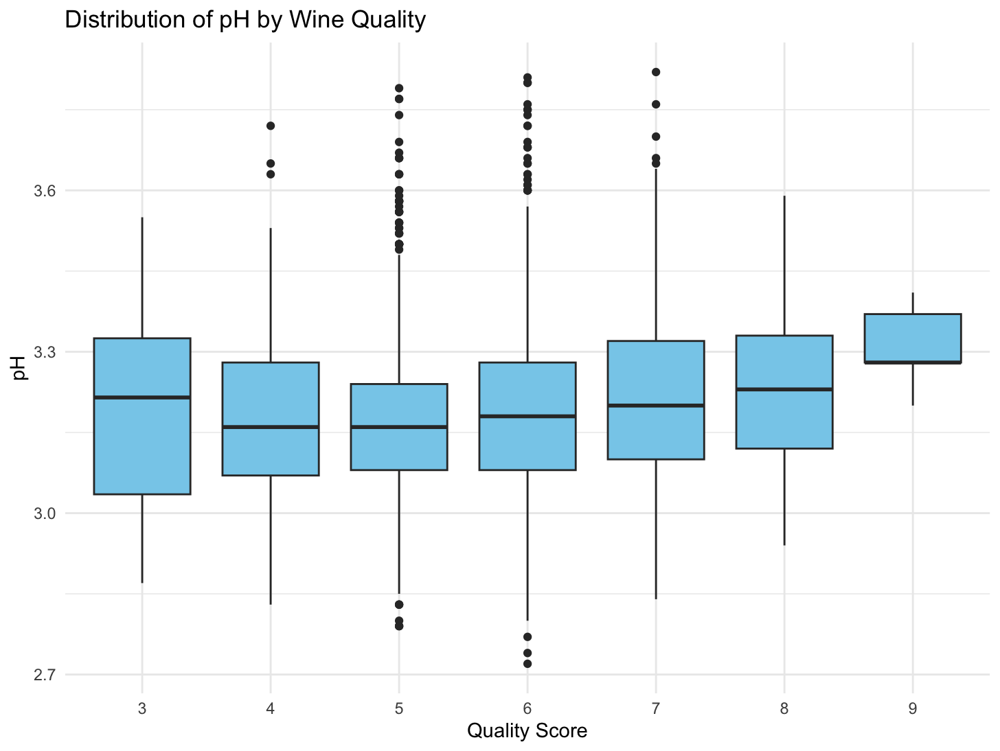
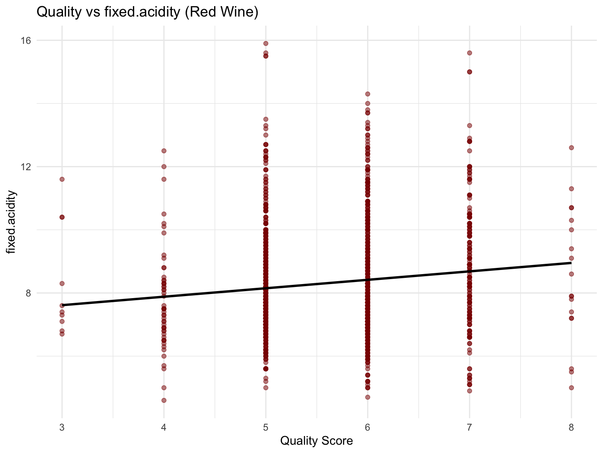

README
================

# Exploratory Data Analysis in R

Author: Harrison Pratt  
Course: Principles of Data Science  
Professor: Professor Lopez  
Date: April 28, 2025

# 1. Business Understanding

When determining if a wine is considered high-quality, there are certain aspects that good wines often have. One of these attributes is having a good acidity. A medium amount of acidity can add freshness and structure but too much or too little can unbalance a wine. Another attribute high-quality wines often have is a good pH level. A pH that is too low or too high can negatively impact the taste of the wine, making it lower-quality. The next important factor is having the right amount of residual sugar. Too much or too little residual sugar can result in imbalanced flavors. Having a balance between these attributes helps create a balanced wine with complexity which are the most important aspects of a good wine.

# - **Acidity**:

A medium amount of acidity can add freshness and structure to the wine. However, too much or too little acidity can unbalance the wine. \# - **pH Level**: A pH level that is too low or too high can negatively impact the wine’s taste, leading to a lower-quality wine. \# - **Residual Sugar**: The right amount of residual sugar is crucial. Too much or too little can result in an imbalanced flavor profile.

A balance between these attributes helps create a wine with complexity, which is vital for a good wine.

# Sources for Understanding:

- [Perceiving Acidity in Wine - Wine Spectator](https://www.winespectator.com/articles/perceiving-acidity-in-wine)
- [Sugar in Wine - Decanter China](https://www.decanterchina.com/en/news/Decanter%20Features/sugar-in-wine)
- [Sugar Content in Wine Explained - Farang Wine](https://www.farangwine.com/sugar-content-in-wine-explained-which-wines-have-the-most-and-least-sugar)
- [What Makes a Wine Good - Medium](https://medium.com/data-science/what-makes-a-wine-good-ea370601a8e4)

# 2. Data Understanding

The dataset consists of wine samples from the North of Portugal, specifically red and white vinho verde wines. The data contains physicochemical tests for each sample. Below is an overview of the dataset:

- **Number of Samples**:
  - White wine: 4,898
  - Red wine: 1,599
  - Total samples: 6,497
- **Features**:
  - 11 continuous features
  - 1 integer feature
  - 1 categorical feature

### Variables:

| Variable_Name | Measurement_Scale | Type | Description |
|:---|:---|:---|:---|
| fixed_acidity | Ratio | Continuous | Tartaric acid level |
| volatile_acidity | Ratio | Continuous | Acetic acid content (wine fault) |
| citric_acid | Ratio | Continuous | Citric acid content |
| residual_sugar | Ratio | Continuous | Sugar left after fermentation |
| chlorides | Ratio | Continuous | Salt content |
| free_sulfur_dioxide | Ratio | Continuous | Free SO₂ (preserves freshness) |
| total_sulfur_dioxide | Ratio | Continuous | Total SO₂ (free + bound) |
| density | Ratio | Continuous | Wine density |
| pH | Interval | Continuous | Acidity level (inverse scale) |
| sulphates | Ratio | Continuous | Sulfate content (preservative) |
| alcohol | Ratio | Continuous | Alcohol content |
| quality | Ordinal | Integer | Wine quality score (0–10) |
| color | Nominal | Categorical | Type of wine: red or white |

# 3. Data Preparation

The dataset was downloaded from [UCI Wine Quality Dataset](https://archive.ics.uci.edu/dataset/186/wine+quality). The data was provided in a zip file, which was then extracted into a folder containing three files:

1.  **Red wine data** (CSV)
2.  **White wine data** (CSV)
3.  **Citation information file**

The files were loaded and prepared for analysis in R.

# 4. Exploratory Data Analysis (EDA)

The EDA process includes visualizations, statistical tests, and hypothesis testing based on business understanding. Below are the hypotheses and results.

### Hypotheses:

1.  **Fixed Acidity Hypothesis**:
    - **Null Hypothesis (H0)**: There is no significant relationship between fixed acidity and wine quality.
    - **Alternative Hypothesis (Ha)**: Fixed acidity significantly influences wine quality, with a moderate amount contributing to higher quality.
2.  **pH Hypothesis**:
    - **Null Hypothesis (H0)**: There is no significant relationship between pH and wine quality.
    - **Alternative Hypothesis (Ha)**: pH significantly influences wine quality, with optimal pH levels contributing to higher quality wines.
3.  **Residual Sugar Hypothesis**:
    - **Null Hypothesis (H0)**: There is no significant relationship between residual sugar and wine quality.
    - **Alternative Hypothesis (Ha)**: Residual sugar significantly influences wine quality, with balanced levels contributing to higher quality wines.

# Statistical Plots White Wine:

         

# Code for White Wine Scatter Plots:

{ p \<- ggplot(wine_white, aes(x = quality, y = .data\[\[feature\]\])) + geom_point(alpha = 0.5, color = “darkblue”) + geom_smooth(method = “lm”, color = “red”, se = FALSE) + labs(title = paste(“Quality vs”, feature, “(White Wine)”), x = “Quality Score”, y = feature) + theme_minimal() print(p) }

# Code for White Wine Box Plots:

library(ggplot2)

features \<- c(“fixed.acidity”, “volatile.acidity”, “citric.acid”, “pH”, “residual.sugar”)

for (feature in features) { p \<- ggplot(wine_white, aes(x = factor(quality), y = .data\[\[feature\]\])) + geom_boxplot(fill = “skyblue”) + labs(title = paste(“Distribution of”, feature, “by Wine Quality”), x = “Quality Score”, y = feature) + theme_minimal() print(p) }

# Statistical Analysis Results:

1.  Fixed Acidity vs. Quality (White Wines)

- **Correlation coefficient (r)**: -0.1137
- **t-statistic**: -8.005
- **p-value**: 1.48 × 10⁻¹⁵
- **95% Confidence Interval**: \[-0.1412, -0.0859\]

Code: cor_test_fixed_acidity \<- cor.test(wine_data$fixed.acidity, wine_data$quality) cor_test_fixed_acidity

The negative correlation is statistically significant (p \< 0.001), though weak. As fixed acidity increases, quality slightly decreases.

# 2. pH vs. Quality (White Wines)

- **Correlation coefficient (r)**: 0.0994
- **t-statistic**: 6.992
- **p-value**: 3.08 × 10⁻¹²
- **95% Confidence Interval**: \[0.0716, 0.1271\]

Code: cor_test_pH \<- cor.test(wine_data$pH, wine_data$quality) cor_test_pH

A weak positive correlation is statistically significant, suggesting higher pH levels are associated with better wine quality.

## 3. Residual Sugar vs. Quality (White Wines)

- **Correlation coefficient (r)**: -0.0976
- **t-statistic**: -6.860
- **p-value**: 7.72 × 10⁻¹²
- **95% Confidence Interval**: \[-0.1252, -0.0698\]

Code: cor_test_residual_sugar \<- cor.test(wine_data$residual.sugar, wine_data$quality) cor_test_residual_sugar

A significant negative correlation indicates that excessive residual sugar lowers wine quality.

# Statistical Plots Red Wine:

# 

# 

# 

# 

# 

# 

# 

# 

# 

# 

# Code for Red Wine Scatter Plots

Plot for fixed.acidity vs quality ggplot(wine_red, aes(x = quality, y = fixed.acidity)) + geom_point(alpha = 0.5, color = “darkred”) + \# Scatter plot points geom_smooth(method = “lm”, color = “black”, se = FALSE) + \# Regression line labs(title = “Quality vs Fixed Acidity (Red Wine)”, x = “Quality Score”, y = “Fixed Acidity”) + theme_minimal()

Plot for volatile.acidity vs quality ggplot(wine_red, aes(x = quality, y = volatile.acidity)) + geom_point(alpha = 0.5, color = “darkred”) + geom_smooth(method = “lm”, color = “black”, se = FALSE) + labs(title = “Quality vs Volatile Acidity (Red Wine)”, x = “Quality Score”, y = “Volatile Acidity”) + theme_minimal()

Plot for citric.acid vs quality ggplot(wine_red, aes(x = quality, y = citric.acid)) + geom_point(alpha = 0.5, color = “darkred”) + geom_smooth(method = “lm”, color = “black”, se = FALSE) + labs(title = “Quality vs Citric Acid (Red Wine)”, x = “Quality Score”, y = “Citric Acid”) + theme_minimal()

Plot for pH vs quality ggplot(wine_red, aes(x = quality, y = pH)) + geom_point(alpha = 0.5, color = “darkred”) + geom_smooth(method = “lm”, color = “black”, se = FALSE) + labs(title = “Quality vs pH (Red Wine)”, x = “Quality Score”, y = “pH”) + theme_minimal()

Plot for residual.sugar vs quality ggplot(wine_red, aes(x = quality, y = residual.sugar)) + geom_point(alpha = 0.5, color = “darkred”) + geom_smooth(method = “lm”, color = “black”, se = FALSE) + labs(title = “Quality vs Residual Sugar (Red Wine)”, x = “Quality Score”, y = “Residual Sugar”) + theme_minimal()

# Code for Red Wine Box Plots

Box plot for Fixed Acidity vs Quality ggplot(wine_red, aes(x = as.factor(quality), y = fixed.acidity)) + geom_boxplot(fill = “darkred”, color = “black”) + labs(title = “Fixed Acidity vs Quality (Red Wine)”, x = “Quality Score”, y = “Fixed Acidity”) + theme_minimal()

Box plot for Volatile Acidity vs Quality ggplot(wine_red, aes(x = as.factor(quality), y = volatile.acidity)) + geom_boxplot(fill = “darkred”, color = “black”) + labs(title = “Volatile Acidity vs Quality (Red Wine)”, x = “Quality Score”, y = “Volatile Acidity”) + theme_minimal()

Box plot for Citric Acid vs Quality ggplot(wine_red, aes(x = as.factor(quality), y = citric.acid)) + geom_boxplot(fill = “darkred”, color = “black”) + labs(title = “Citric Acid vs Quality (Red Wine)”, x = “Quality Score”, y = “Citric Acid”) + theme_minimal()

Box plot for pH vs Quality ggplot(wine_red, aes(x = as.factor(quality), y = pH)) + geom_boxplot(fill = “darkred”, color = “black”) + labs(title = “pH vs Quality (Red Wine)”, x = “Quality Score”, y = “pH”) + theme_minimal()

Box plot for Residual Sugar vs Quality ggplot(wine_red, aes(x = as.factor(quality), y = residual.sugar)) + geom_boxplot(fill = “darkred”, color = “black”) + labs(title = “Residual Sugar vs Quality (Red Wine)”, x = “Quality Score”, y = “Residual Sugar”) + theme_minimal()

# 1. Fixed Acidity vs. Quality (Red Wines)

- **Correlation coefficient (r)**: 0.1241
- **t-statistic**: 4.996
- **p-value**: 6.50 × 10⁻⁷
- **95% Confidence Interval**: \[0.0755, 0.1720\]

Code: cor_test_fixed_acidity_red \<- cor.test(wine_red$fixed.acidity, wine_red$quality) print(cor_test_fixed_acidity_red)

A small positive correlation suggests that moderate acidity might improve the quality of red wines.

# 2. pH vs. Quality (Red Wines)

- **Correlation coefficient (r)**: -0.0577
- **t-statistic**: -2.311
- **p-value**: 0.02096
- **95% Confidence Interval**: \[-0.1065, -0.0087\]

Code: cor_test_pH_red \<- cor.test(wine_red$pH, wine_red$quality) print(cor_test_pH_red)

A weak negative correlation shows that lower pH (higher acidity) may slightly improve wine quality.

# 3. Residual Sugar vs. Quality (Red Wines)

- **Correlation coefficient (r)**: 0.0137
- **t-statistic**: 0.5488
- **p-value**: 0.5832
- **95% Confidence Interval**: \[-0.0353, 0.0627\]

Code: cor_test_residual_sugar_red \<- cor.test(wine_red$residual.sugar, wine_red$quality) print(cor_test_residual_sugar_red)

No significant correlation was found between residual sugar and wine quality for red wines.

# Conclusion:

This analysis investigated how attributes like acidity, pH, and residual sugar influence wine quality.

- For **white wines**, higher levels of fixed acidity and residual sugar were weakly linked to lower quality, while a balanced pH showed a slight positive relationship with higher quality.
- For **red wines**, fixed acidity showed a weak positive relationship with quality, while pH had a weak negative correlation with better quality wines. Residual sugar did not significantly impact red wine quality.

These results support the idea that wine characteristics play a role in quality, but taste and personal preferences remain crucial factors in wine evaluation.

The findings of this exploratory data analysis can be used to guide winemakers in balancing important factors like acidity, pH, and residual sugar. Understanding the relationships between these attributes and wine quality allows for more informed decisions during the winemaking process.
